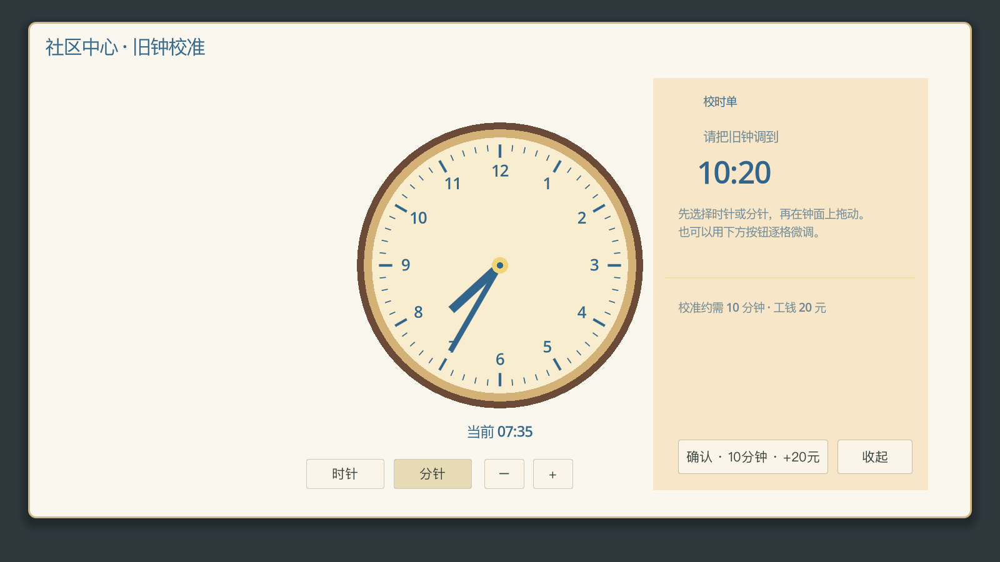
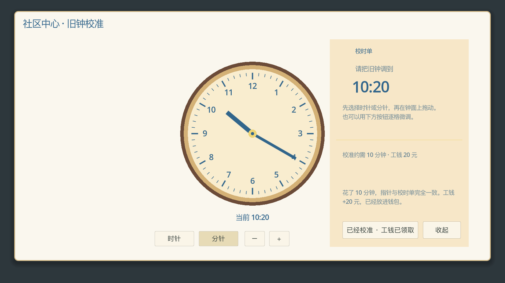

# 小游戏主体机制三处修复验收

日期：2026 年 9 月 26 日，北京时间。依据《主体机制-系统设计(3).docx》和用户授权，修复初次检查确认的前三项问题。已合并远程 `35823e2` 的后续工作，保留独立饭店的未提交改动。

## 修复后的行为

1. **先发现，再排程。** 听完邀请、接受邀请或获得带玩法来源的活动线索，就能在首次游玩前安排音乐、书信、棋局等已知活动。“知道这件事”不再依赖“已经开始过玩法”；不会因为发现活动而增加游玩次数、时间或收入。旧存档中的邀请与线索直接兼容，发现记录保持角色私有。原有角色、章节、连续空档、营业时间和计划冲突检查继续生效。
2. **出餐留下经历，后续互动才签名。** 移除厨房两种菜单的直接签名配置，并在普通与外部结算入口屏蔽遗留签名奖励。真实备料、尝味、装盘和出餐时，若石泳琪实际在场，记录一个带角色、时间、地点及具体店主回应的人物侧面。重复做菜不刷侧面，未在场的人不获得虚构侧面；之后仍需一次不同的观察和稍后的面对面回顾才能签名。既有签名继续保留。保存失败时新增经历与时间、资源和菜谱一并撤销。
3. **校钟作为十分钟短工作结算。** 操作前显示“10 分钟 / 20 元”，确认时检查实际地点、营业时间、完整空档和其他活动占用。成功后结算十分钟、身体/投入/思绪变化和一次收入，账目记录实际工作时长。保存失败时恢复整份快照，包括时间、钱包、账目、日志、生活状态及领取标记，并明确提示可重试。重复确认、读档或换角色不会再次领钱。图像验收时还修正了钟面 10–12 刻度文字被裁切的问题。

十分钟是本次为短工作设定的时长，附件未给出校钟的具体分钟数。

## 验证结果

Godot 4.7.2。使用临时项目和随机唯一的 `Solmere_Test_` 用户目录，主游戏和扩展的所有 `user://` 存档均与正式存档隔离。录音和五日流程使用真实图形、音频设备；流程读档另开进程验证。

| 检查 | 结果 |
| --- | --- |
| 三处修复专项回归 | 123 项 / 0 失败 |
| 日常生活与人物认知 | 74 项 / 0 失败 |
| 厨房实际操作与反馈 | 通过 / 0 失败 |
| 交易边界 | 18 项 / 0 失败 |
| 私有角色工具与状态 | 50 项 / 0 失败 |
| 真实全局录音 | 38 项 / 0 失败 |
| 完整五日流程 | 223 项 / 0 失败 |
| 退出后另进程读档 | 13 项 / 0 失败 |
| 校钟实际选择与微调按钮、确认、画面 | 通过 |

专项测试覆盖首次音乐/书信/棋局排程、旧邀请数据、跨日与角色隔离、A/B 两种厨房菜单、遗留配置注入、厨房保存失败及重试、重复做菜、后续面对面签名、旧签名保留、校钟空档不足/关门/异地/活动冲突、全量保存失败回滚、正确重试及重复领取。

所有验收进程均返回 0。部分无窗口测试及独立校钟截图进程在退出时报告 ObjectDB / resource 清理提示；相关运行断言通过，完整五日流程和另进程读档没有脚本错误。这些退出清理提示保留在原始日志中，不列为本次已修复问题。

原检查中交易快照失败和旧五日流程接口问题，已由本次合并的远程提交修正；上表为合并后的实测结果。初次全量审计中其他支线设计缺口与鼠标测试问题，仍按原报告单独跟进，不能据此宣称所有小游戏全面验收完毕。

## 证据与复跑

原始结果见 [测试汇总](minigame_system_fixes_20260926/final_results.json)，每个测试的完整日志在同目录。对应生产源码与专项测试的 SHA-256 见 [源码校验](minigame_system_fixes_20260926/source_hashes.json)。

复跑 `tests/integration/test_minigame_system_fixes.gd` 时须复制项目配置，启用自定义用户目录并设为新的唯一 `Solmere_Test_...` 名称，再传入 `--isolated-save`。只有 `--isolated-save` 不能隔离所有扩展存档，专项测试会拒绝直接使用正式项目配置。

完整流程使用 `test_five_day_flow.gd`；完成后同一隔离用户目录下另开进程，增加 `--reload-only` 验证重启读档。录音和完整流程应使用正常图形/音频模式，不使用 headless。

