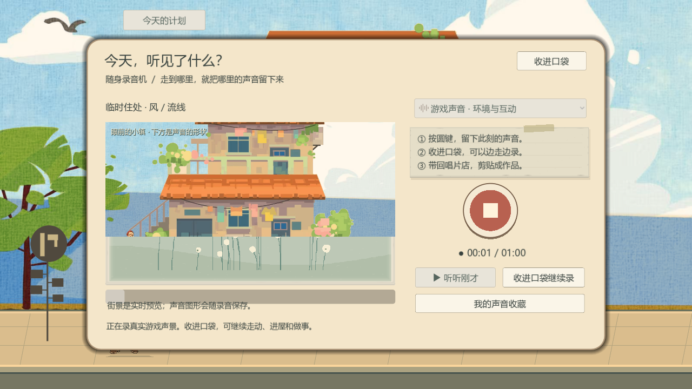
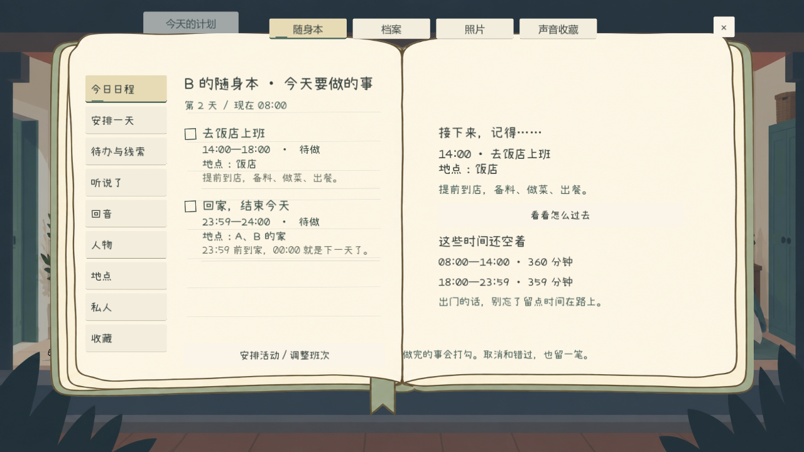
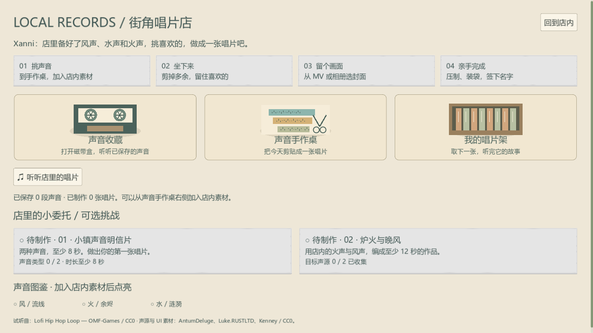
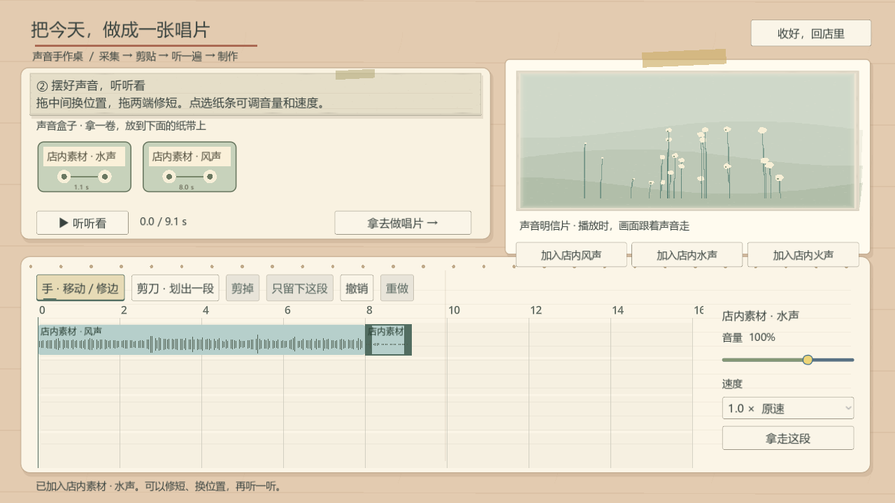

# Solmere：开源资源接入与功能复查

日期：2026-09-26。运行环境：Godot 4.7.2 / Windows / Compatibility renderer / WASAPI。

## 本轮实际完成

继续使用现有主游戏，合并 main 的全局录音、声音手作桌、拼贴缓存及厨房更新。没有另起一份只展示图片的网页，也没有把其他商业游戏的界面截下来当按钮。原人类角色、用户提供的住处和唱片店老板、已有背景与手绘场景保留。

- 导入 38 张 Skymon 手绘 PNG（39 个语义映射）和 25 个 Kenney OGG（21 种声音提示）。图标用于设置、关闭、通知、结账和编辑工具等既有接口，保留已确认的随身物件外形。备用映射不计为已展示的功能。
- 真实改编两处 MIT 代码：音效播放器的获取/回收，以及原生 UI 控件的声音信号绑定。最多 8 个界面提示声，重要反馈优先，重复连接、程序刷新、快速连续操作不会叠成一片声音。合并时保留世界音效的独立 12 路音效池。
- 界面与世界声音分总线。门、厨房锅具等真实动作可录入游戏音轨，按钮和试听不混进现场录音。设置、对话、滑杆、纸页、确认、拒绝和购买使用统一反馈。
- 纸面弹窗补上键盘焦点边界和关闭后的焦点恢复；菜单保存失败明确反馈。购物保留直接结账按钮，失败购买不会偷偷修改生活状态。
- A 的录音界面显示实际场景预览和音频驱动的图形。已保存录音回放声音图，不拿当前街景冒充过去的视频。默认采游戏音轨，麦克风由玩家主动选择。
- 修正合并后的角色权限：A 有录音机、没有本子；B 有手写待办本、没有录音机。按钮、快捷键与采集服务均检查权限。B 可在唱片店点「加入店内风声／水声／火声」，获得真实、可保存和剪辑的声音，不伪装成外出录音。
- 店内素材加入后立即更新声音盒和时间轴；重复使用不重复生成源文件。失败保存回滚，离开唱片店不能远程调用素材入口。B 的收藏按钮和制作引导已适配，隐藏 B 无法采集的可选声源挑战。
- 实际冲洗领取的照片进入原有拼贴素材目录，可选取、裁切、保存和重载。持久保存源照片 ID，不因新增或丢失照片导致旧拼贴引用到另一张图；原照片文件不被裁切覆盖。
- 核对存档原子写入：临时文件唯一命名、显式关闭、读取校验后替换；失败保留可重试的现场和音频，不显示虚假的成功。

## 参考与授权

采用用户已指定的 Summer House 的克制色彩与层次、Venba 的实体操作与轻量引导作为设计参考；不导入它们的商业图像、音乐或角色。手绘轮廓、米色纸张、灰绿与陶土色沿用本作已确认方向。没有新增荧光粉紫色界面。

| 来源 | 条款与实际用途 |
|---|---|
| [Skymon 官方页](https://defacegames.com/product/skymon-icon-pack-free/) / [作者 CC0 发布页](https://opengameart.org/content/skymon-icon-pack-free) | v250329，CC0。保留原 PNG 字节，只在运行时染色和缩放。没有证据表明这套图标来自已发行游戏，不作此宣传。 |
| [Kenney Interface Sounds](https://kenney.nl/assets/interface-sounds) / [RPG Audio](https://kenney.nl/assets/rpg-audio) | CC0，保留原 OGG；按实际交互调低响度。 |
| [Nathan Hoad Godot Sound Manager](https://github.com/nathanhoad/godot_sound_manager) | MIT，固定提交 1c041582db806a0d0edad77111d1fb7a009346ef；复用音效池机制。 |
| [Maaack Godot UI Sound Controller](https://github.com/Maaack/Godot-UI-Sound-Controller) | MIT，固定提交 4ae5fd97b363b8236abfe616179226aa03ded0cd；适配原生控件信号绑定。 |

逐文件源地址、原包成员名、SHA-256 和运行映射在 `data/presentation/open_ui_manifest.json`。全部许可原文在 `third_party/licenses/`；成品外部继续附带第三方声明，游戏内致谢按用户要求留空。原有 Cila、Little Chef 等资源仍按各自原许可安装与分发，不把“免费使用”扩大成“允许公开原始素材包”。

## 逐项核对既有要求

| 最新要求 | 本轮检查及边界 |
|---|---|
| 五日主流程，作品集不阻塞，保留可用小游戏 | 实际跑完 A/B 五天、会面、交换后跨领域活动；做饭、棋局、音乐、寄信均有实际完成过程。 |
| A 录音机 / B 手写日程分开 | 所有入口及服务层检查；B 当日时间、地点、状态、空档与午夜期限可见，完成才勾选。 |
| 文字可读、弹窗尺寸稳定、UI 统一 | 保留纸页/实体工具体系，测试主要弹窗尺寸、文字区域与焦点；16 张实际渲染页面留档，重点页面附后。不同小游戏保留各自适合操作的布局，未声称逐像素完全一致。 |
| 地图主体完整、手绘、边缘不碎 | 复查现有纸地图与当前地点/可用路线；未重画已确认地图。 |
| 原人类角色、AB 住处、店主保留 | 相对合并 main 基线核对已有美术源文件哈希，场景与人物没有换成动物或重新生图。 |
| 行走、站位、门口接近、NPC 不跟随闪现 | 街道运动、夜间交互、室内、固定住民空间与指定房屋回归。当前仍是原有 2D 角色方案，不称为逐帧重画的新动画。 |
| 清晰地面、建筑基线、交通在右边、路牌数量 | 现有街道布局与架构检查；历史截图审美不是自动断言的替代品。 |
| 日／昏／夜、下雨、过渡不闪变 | 环境过渡、夜间互动与已有天气声音回归；是游戏中的风格化时间天气，不宣称真实天文潮汐模拟。 |
| 营业时间与推荐一致，杂货店无多余室内 | 真实时间、入口与购物路线检查；保留摊位购买流程。 |
| 23:59 回家，00:00 次日 | 强制午夜及次日切换回归，不改成 00:30。 |
| 直接结账、开始工作进入厨房、实际工资 | 购物交易、厨房动作和工作结算检查；完整五天用实际出餐结算。 |
| 录音有实时画面、能够制成唱片 | 像素比较实时场景、非静音 PCM、声音事件图、剪辑混音、唱片保存及跨场景采集。B 使用明确标注的店内音源。 |
| 拼贴有真实加素材入口 | 实拍→冲洗→领取→素材卡→裁切→保存→重载，81 项摄影/拼贴检查。 |
| 星云清晰、可隐藏 UI、照片观察 | 现有 telescope 回归及资源读写失败检查；本轮未新建星云模型，未宣称新增科学体积重建。 |
| 去开场动画、公共作品架与多余物件 | 现有五日启动与架构检查；不恢复已取消的“消除误解”玩法。 |
| 回信、菜单点赞等清晰反馈 | 统一通知提示与音效；既有回信与实际作品状态参与五日回归，不用假计数替代成功。 |
| 免费商用素材、真实调用开源机制 | 上表逐项记录；新媒体随包真实加载，代码挂在主游戏现有总线上，非仅下载备用。 |

## 可复现验证

当前套件 **34 / 34 通过**。完整五日流程 **223 项检查**通过，单独退出并重新加载 **13 项检查**通过；照片到原拼贴 **81 项**、新 UI/音效 **77 项**、店内音源 **15 项**检查通过。最新结果按测试名称汇总，保留原执行批次；不是把失败日志静默改成成功。

- [机器结果与逐项日志](open-polish-20260926/results.json)
- [跨进程重新加载](open-polish-20260926/five-day-reload.txt)
- [已有源美术一致性](open-polish-20260926/approved-source-integrity.json)
- [回归期间 540 个 art 跟踪文件未被修改](open-polish-20260926/art-integrity.json)
- [导出 PCK 后再次执行的 77 项资源与控件检查](open-polish-20260926/packed-resource-check.txt)，通过；Windows 成品已启动并观察到实际主菜单。16 页渲染截屏用于检查文字及布局，不把截图脚本的自动操作称为人工鼠标验收。

命令：

```powershell
python tools/import_solmere_resources.py --verify-only
python tools/qa_open_polish.py --godot '<Godot 4.7.2 console executable>'
```

脚本为每项检查建立独立 APPDATA/LOCALAPPDATA 和 `--isolated-save`，使用真实 GPU 渲染和 WASAPI，不触碰正式存档。仅排除沙箱系统根证书读取错误；星云测试明确记录一条故意向文件路径创建目录的预期错误。其他脚本或资源错误仍判失败。

### 历史检查的处置

[原始历史扫描](open-polish-20260926/historical-scan.json)保留 40 项旧套件的真实结果。以下 11 项旧夹具仍保留在源码或记录中，当前套件采用实际新流程替代；`--historical` 可以重跑，失败仍会显示。没有宣称所有历史测试通过。

| 旧检查 | 不适用的原因 / 当前覆盖 |
|---|---|
| starting_budgets | 旧无版本迁移期望；当前五日存档版本、双角色钱包及交易边界检查。 |
| scene_atlas | 旧场景索引；当前 architecture_alignment、home_interiors、night_and_interaction。 |
| resident_spaces | 旧杂货店内部与已取消的日程预设；当前商店路线与固定角色空间。 |
| coastal_composition | 旧 NPC 类型和瞬时夜景断言；当前街道与平滑环境过渡。 |
| crisp_street | 假定不存在后来确认的统一调色；保留已确认调色，检查源图完整。 |
| late_night_people | 旧可跟随传送的居民安排；当前固定位置与营业/夜间交互。 |
| linear_dialogue | 旧角色室内外及营业时间夹具；当前 dialogue_presentation 的实际地点/自由时间。 |
| life_feedback | 已删除公共作品架及旧字典结构；当前实际作品/回信与五日结果。 |
| native_modules | 旧快捷假照片与取消的误解模块；实际胶卷摄影、原拼贴与可用小游戏。 |
| letter_workshop | 恢复原拼贴后旧独立脚本不再存在（仅 UID 残留）；现有拼贴视口、实际寄信与重载。 |
| feedback_systems | 旧直接领取工资夹具；当前出餐后才发工资。 |

### 仍需明确的限制

自动检查和当前截图不能证明所有机器、所有窗口比例和所有剧情组合都没有问题。真人麦克风权限/语音质量没有替代玩家实测；声音动态图是本地同步绘制，并非云端理解声音后生成视频。实时街景预览不作为录制视频保存。部分历史参考图片的商用来源仍待项目方明确，具体记录见 `THIRD_PARTY_LICENSES.md`，不把新导入 CC0/MIT 的许可推广到整个游戏。

## 当前实际画面









