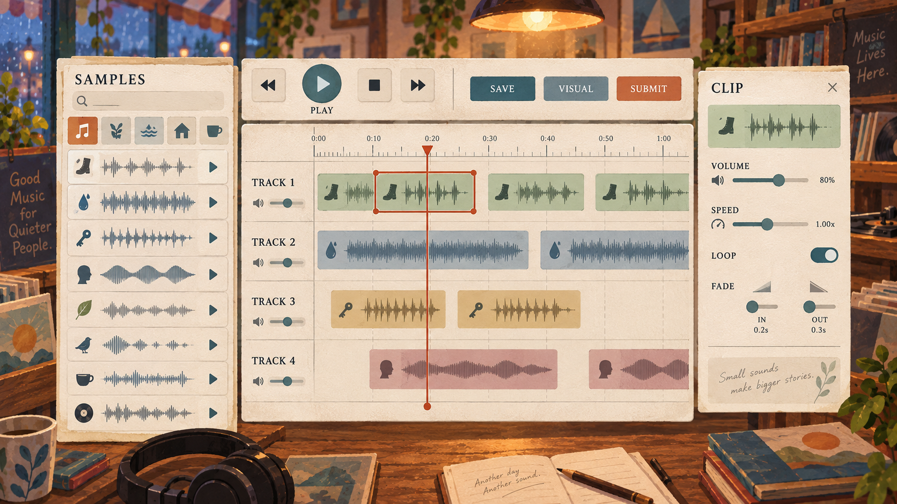
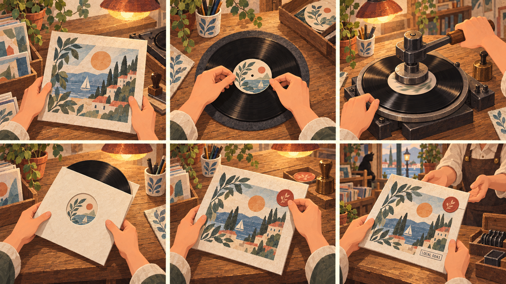

# Solmere 声音档案系统完整设计手册

版本 1.0  
日期 2026 年 9 月 13 日  
用途 非代码前期设计 美术交互音频叙事与制作验收依据

## 文档结论

Solmere 的声音系统应被定义为贯穿七天生活探索的“声音档案机制”，而不是唱片店里的一次性小游戏。玩家在小镇中听见并采集声音，将素材带回潮声唱片，在一套简化但真实的四轨工作台中亲手剪辑，再把声音转译成原创动态抽象画面，最后通过一套有触感的制作仪式把工程冻结成唱片。唱片进入本地货架，未来可在安全、可控的前提下进入社区货架。

本手册把四份输入材料、当前 Godot 项目和现有 Town Sound 原型统一为一份可执行的产品基线。凡涉及界面、镜头、玩法、数据、隐私、可访问性、美术资产和验收的后续工作，都应以本手册为准；概念图用于确认方向，不作为可直接上线的最终资产。

## 设计北极星

玩家最终应能说出五句话。

- 普通声音也值得被我停下来听。
- 这首作品是我剪出来的，不是系统替我生成的。
- 我能决定声音在视觉上是什么感觉。
- 我把一个数字工程亲手做成了一件物品。
- 它真的留在了 Solmere，并可能被另一个人听见。

成功体验的最短表达是：听见，记录，整理，解释，制作，留下。

## 一 四份材料的统一结论

### 第一张图定义空间语法

所有主要地点采用同一条可学习的空间链：街道横版探索，建筑正面，推门进入，室内横版舞台，靠近物件，切换近景或小游戏，完成后返回原室内。镜头不突然跳成第一人称，也不让每个地点拥有互不相干的导航方式。

### 第二张图定义注意力流

玩家先阅读建筑和人群，再阅读人物关系，最后阅读物件。对话、互动提示、镜头推进和小游戏不是四套界面，而是同一空间里逐渐加深的四个注意力层级。对话不能把场景完全遮住，小游戏也应保留地点的材质、色彩和声音。

### 第三张图只提供对话层级参考

保留“对话发生在舞台里”“文字层级清楚”“选择容易扫读”三点。不保留冷灰低多边形画风、纯黑大矩形、全大写窄体字、原有箭头、指针和排版比例。Solmere 的对话语言应来自暖纸、海军蓝油墨、陶土色签条、唱片沟槽和轻微印刷错位。

### 机制文件定义全局闭环

声音采集、四轨编曲、动态视觉、实体唱片制作、老板反馈、付款、上架和社区试听必须形成同一条链。核心不是音乐技术的复杂度，而是玩家对声音意义和作品结构拥有作者权。

## 二 产品边界与不可妥协项

### 必须保留

- 默认采集 Solmere 当前正在播放的游戏内声音，不要求麦克风。
- 真实麦克风只能由玩家主动选择，并显示清楚的权限和本地保存说明。
- Studio 至少保留 Sample Library、Waveform、Track、Timeline、Playhead 和 Clip。
- 玩家可移动、裁切、切分、复制、循环、调音量、调速度和淡入淡出。
- 编辑必须非破坏性，原始 Sample 不因 Timeline 操作被改写。
- 视觉由声音数据驱动，Prompt 只改变解释方式，不把声音变成字面场景插画。
- 同一工程、同一视觉配置、同一 Seed 应尽量得到相同结果。
- Project 是可编辑工程，Record 是压片后冻结的最终作品。
- 唱片制作必须可见、可操作、可中断恢复，不能以一个保存按钮替代。
- 单机离线闭环必须完整，联网失败不能破坏本地作品。
- 社区只发布最终成品及必要元数据，不上传原始工程和全部 Sample。

### 明确避免

- 选择几个音效后由系统自动拼歌。
- 对作品进行 S A B 等级或审美分数评价。
- 普通频谱柱、夜店霓虹、科技 HUD 或生成式人物画面。
- 以排行榜、点赞和关注刺激创作焦虑。
- 默认采集桌面其他应用声音或未授权人声。
- 为了显得专业而堆叠 EQ、压缩器、MIDI、VST 和复杂路由。

## 三 玩家全局旅程

### 七天中的节奏

第 1 天只让玩家注意声音，不要求产出。玩家在公交站或街道得到便携录音设备，并完成一个 10 至 20 秒的游戏内声景录制。

第 2 天通过一个生活事件再次提示录音，例如餐馆杯碟、棋社落子或雨棚滴水。系统只提示“这段声音可以留下”，不要求分类。

第 3 天进入声音来源与授权切片。玩家理解环境声、表演声、私人谈话和未知来源不能被一概视为可公开使用。

第 4 天首次进入唱片店 Studio，完成 2 至 3 个素材、3 条轨道、20 至 40 秒的第一次编排，并保存 Project。

第 5 天开放 Visual Mode。玩家输入一句视觉描述，比较两个 Seed，选择一个动态视觉方向。

第 6 天完成压片仪式和上架。第一次唱片默认进入 Local Recordings，不强迫发布社区。

第 7 天让这张唱片在世界里产生回声：店主播放、某位居民提到、结局相册出现，或在 A B 其中一人的记录中被重新解释。

### 自由玩家的非线性路径

七天节奏只负责首次引导。完成第一次唱片后，录音、编曲和压片均可自由回访。稀有声音由地点、天气、时间和 NPC 日程自然产生，不显示为机械化收集图鉴。玩家可以只收藏声音而不压片，也可以反复修改 Project 后再冻结新版本。

## 四 垂直切片蓝图

### 验证目标

垂直切片只验证一件事：一个不懂音乐的玩家，能否在 35 至 55 分钟内从小镇声景中取得三个素材，完成一段可辨认的个人编排，生成与声音同步的抽象视觉，并把它做成一张愿意留下的唱片。

### 场景范围

- 一段海边街道，包含公交站、唱片店门面和两个可触发短音的环境物件。
- 一个完整唱片店室内舞台，含店主、Studio、Visual Room、Pressing Table 和 Record Shelf。
- 一个雨天或傍晚状态，用来验证外冷内暖、环境声变化和回访氛围。

### 切片素材

- 公交到站与刹车声。
- 海浪或雨棚连续声。
- 脚步、翻页、钥匙或杯碟中的一个短促声。
- 一段由 NPC 明确授权的哼唱或演奏，作为可选素材。

### 切片完成条件

- 至少保存 3 个不同 Sample。
- 至少使用 3 条 Track 和 4 个 Clip。
- 至少完成一次 Trim 或 Split、一次 Duplicate 或 Loop、一次 Volume 或 Fade 调整。
- 成品时长 20 至 60 秒。
- Visual Mode 至少生成两个 Seed，并选择一帧作为封面。
- 完成精简版六步压片流程。
- 唱片在本地货架可重新试听，退出和读档后仍存在。

### 不进入首个垂直切片

- 公共社区后端。
- 评论、点赞、排行和关注。
- 超过四轨、自动节拍检测和高级时间伸缩。
- Sample 级任意形状编辑器。
- 多设备云同步。
- 麦克风真实人声作为必经流程。

## 五 空间与镜头系统

### 镜头状态

| 状态 | 画面职责 | 玩家控制 | 退出方式 |
| --- | --- | --- | --- |
| 街道宽景 | 看见建筑、人群、天气和目的地 | 左右移动、查看、进入 | 走出范围或进入建筑 |
| 建筑门口 | 确认地点、时间与进入成本 | 进入、返回 | 返回街道 |
| 室内舞台 | 阅读人物关系与物件分布 | 左右移动、对话、靠近热点 | 推门离开 |
| 互动靠近 | 将注意力交给一个物件 | 确认、取消 | 退回室内舞台 |
| 物件近景 | 进行 Studio、压片或试听 | 指针、拖拽、键盘或手柄 | 保存或取消返回 |

### 切镜规则

- 进入室内使用 0.45 至 0.75 秒的横向滑入与门铃声，不使用全黑硬切。
- 室内到物件近景由人物靠近、坐下或伸手触发，物件先在原场景中获得高亮，再推进镜头。
- 近景保留至少一个地点连续性线索，例如同一盏灯、窗外雨声、桌面植物或墙上唱片。
- 减少动态效果开启时，所有平移改为 120 至 180 毫秒淡入淡出。
- 返回时落点固定在触发物件前，不把玩家送回室内入口。

### 互动提示

默认提示只显示按键和动作，例如“E 制作唱片”。玩家进入交互半径后淡入，离开后淡出；同一时间只突出一个最高优先级热点。提示不能使用与对话选择相同的视觉权重。

## 六 原创对话系统

### 对话模式

| 模式 | 使用场景 | 表现 |
| --- | --- | --- |
| 场景短句 | 闲聊、路人、环境观察 | 文字靠近说话人，1 至 2 行，无选项 |
| 聚焦对话 | 店主、核心居民、任务节点 | 底部暖纸面板，人物和场景仍可见 |
| 多人对话 | 两名以上 NPC 同场 | 说话人签条随发言切换，镜头仅轻移 |
| 内心记录 | A B 的观察差异 | 无人名签条，使用窄幅海军蓝边与较慢出现速度 |
| 关键选择 | 改变关系、授权或作品状态 | 右侧或下方展开 2 至 4 个角色化选项 |

### 视觉规则

- 正文使用暖象牙纸底和深海军蓝文字，避免纯白纯黑。
- 说话人使用陶土色小签条，不用大头像抢走舞台关系。
- 选择项悬停时以轻微纸张抬起、唱片沟槽圆点和 80 至 120 毫秒位移反馈。
- 继续提示采用小型唱片沟槽圆环，不使用第三张图的长箭头。
- 面板最大遮挡画面高度为 34%，普通短句不超过 18%。
- 中英文分别控制换行；中文正文建议每行 20 至 28 个汉字，英文每行 42 至 58 个字符。

### 行为规则

- 对话期间默认保留唱机旋转、雨滴、灯光和远处 NPC 的低强度环境动画。
- 玩家可随时打开历史记录，但关键选择确认后不能通过历史记录改选。
- 选项先显示角色真实语气，不显示隐藏数值或结果标签。
- 自动播放按标点停顿，玩家输入可立即显示整句。
- 语音不是依赖项；无语音时，文本、表情动作和环境声仍应完整表达。
- 授权相关对话必须把“可本地保存”“可公开发布”“不可使用”说清楚，不能用模糊好感度替代。

### 示例对话

店主：你带回来的不是一段声音，是三个不同的决定。

玩家选择：

- 我想先把它们分开听。
- 那段谈话不该留在成品里。
- 我只做一份不公开的私人版本。

## 七 便携录音系统

### 声源模式

| 模式 | 默认状态 | 录制范围 | 发布限制 |
| --- | --- | --- | --- |
| 游戏声音 | 默认 | 当前地点的 TownWorld 环境总线与允许录制的互动音 | 可按素材授权发布 |
| 真实麦克风 | 玩家主动开启 | 物理麦克风输入 | 默认 local only，发布需再次确认 |
| 预置教学声 | 首次引导可用 | 内置安全素材 | 可用于本地教学唱片 |

游戏声音不能包含 Studio 试听、唱片架播放、系统提示音或其他应用声音。录音开始时记录地点、游戏日、时间、附近居民、事件和来源范围。真实麦克风开始前必须显示系统权限和本地保存说明。

### 录音流程

1. 玩家打开便携录音机。
2. 选择声源，默认保持游戏声音。
3. REC 后面板可收起，玩家继续移动和触发环境动作。
4. STOP 后展开波形、时长和来源信息。
5. 玩家命名、试听、保存或删除。
6. 保存后生成 Sample Card，系统不替玩家判断“这是什么声音”。

### 限制与保护

- 单次游戏声音建议 3 至 45 秒，真实麦克风建议 3 至 30 秒。
- 首个垂直切片本地素材上限 30 个；接近上限时先提醒整理，不自动删除。
- 未保存录音会阻止离开场景、切换角色或读档，并提供保存、删除、继续录音三种选择。
- 零长度、全静音或损坏音频不能保存为可交付 Sample，但可保留诊断信息。
- 删除进入二次确认；被 Project 引用的 Sample 只能从库隐藏或复制工程后移除。

### Sample Card 字段

sample id、玩家命名、时长、波形缓存、录制时间、地点、角色、附近 NPC、关联事件、声源模式、授权范围、文件哈希、文件路径和版本号。

## 八 Studio 四轨编曲

### 信息布局

左侧是 Sample Library；中间是四轨 Timeline；顶部是播放、暂停、停止、当前时间、保存、Visual 和 Submit；右侧只在选中 Clip 后显示 Inspector。核心时间轴始终占据最大面积，场景装饰只能作为低对比背景。

### Clip 操作定义

| 操作 | 规则 | 必须反馈 |
| --- | --- | --- |
| Move | 左右改变时间，上下改变 Track | 吸附线、目标轨高亮、当前位置时间 |
| Trim | 拖动左右边缘改变使用区间 | 显示原始范围和剩余时长 |
| Split | 在 Playhead 位置切成两段 | 短促切纸声和分隔线 |
| Duplicate | 复制当前 Clip | 新片段轻微抬起并进入拖动状态 |
| Delete | 只删 Timeline Clip | 原始 Sample 仍在 Library |
| Loop | 重复当前裁切区间 | 循环边界与重复次数可见 |
| Volume | 建议 0% 至 150% | 波形视觉高度变化但不改原文件 |
| Speed | 0.5 0.75 1 1.25 1.5 2 倍 | 时长和音高变化立即试听 |
| Fade | 简单淡入淡出 | Clip 两端显示可拖动斜坡 |

### 易学性

- 第一次进入只开放拖入、移动和播放；完成一次摆放后再出现 Trim。
- 完成一次 Trim 后，再介绍 Duplicate 或 Loop。
- Inspector 默认只显示最相关的四个控制，其余通过“更多”展开。
- 任何编辑都支持 Undo Redo；撤销记录至少保留 30 步或本次会话全部步骤。
- 空白工程提供三个非自动化起点：先放连续底层、先排短促节奏、先放人声留白。它们只是教学提示，不替玩家放置素材。

### 工程规则

- 默认四轨，最大时长 60 秒；完整版可扩展到 8 轨和 180 秒。
- Project 自动保存草稿，但玩家主动保存时仍给出明确反馈。
- Submit 前检查至少 2 个不同 Sample、2 个 Clip 和 8 秒；垂直切片建议提高到 3 个 Sample、4 个 Clip 和 20 秒。
- 老板只根据结构参数给出描述性反馈，不进行审美排名。

## 九 Visual Mode

### 设计原则

动态视觉必须看起来从声音本身长出来。Prompt“雨后慢慢亮起来的港口”只改变色彩、稀疏程度、速度和运动倾向，不能直接画出港口、船、灯塔或人物。

### 基础映射

| 音频特征 | 视觉职责 |
| --- | --- |
| Loudness RMS | 整体尺度、透明度、力度和墨层厚度 |
| Peak Transient | 新形状触发、脉冲、扩散和轻微跳动 |
| Low | 大圆、宽色块、低位、慢速呼吸 |
| Mid | 线、弧、中型几何、伸缩和连接关系 |
| High | 小点、短线、小三角、快速但克制的粒子 |
| Track 1 | 后景大形与总体重心 |
| Track 2 | 线条和中层连接 |
| Track 3 | 前景节奏图形 |
| Track 4 | 细小粒子和短促强调 |

### Prompt 解析

本地关键词只映射到 palette、shape weights、speed、density、randomness、negative space、motion 和 texture。无法识别的词保留在玩家描述中，但不偷偷请求联网模型。多个冲突词按最后一次显式选择优先，并允许玩家打开“系统如何理解这句话”的简明参数摘要。

### Seed 与封面

- 同一音频、同一 Visual Profile、同一 Seed 应复现同一构图和时间行为。
- Regenerate 只改变 Seed，不改 Prompt 和音频。
- 玩家可以暂停任意时刻作为封面候选帧。
- 封面裁切必须显示唱片方形安全区和中心标签安全区。
- Visual Profile 和 Seed 随 Record 保存，社区端本地重建动态画面，不上传视频。

## 十 唱片制作仪式

### 完整流程

最终命名，选择视觉帧或本地照片，打印封面，贴中心标签，压制唱片，装入内袋，装入外封套，贴封签，盖章，生成编号，交给老板，上架。

### 垂直切片六步版

1. 命名并选择封面帧。
2. 打印封面并贴中心标签。
3. 拉下压制把手并等待唱片完成。
4. 唱片装入内袋和外封套。
5. 贴封签、盖章并生成 LOCAL 编号。
6. 交给老板并看见唱片进入货架。

### 操作与可访问性

- 每个拖拽动作同时提供点击式替代按钮。
- 按住动作可在设置中改为单击。
- 吸附区域比视觉目标扩大 12 至 20 像素。
- 纸张摩擦、标签贴合、机器下压、印章和唱片入架均有独立声音与震动反馈。
- 中断后恢复到最近完成步骤，不要求重新压片。
- 最终确认前显示公开范围、标题、作者名、封面和音频时长。

### 上架动画

老板接过唱片，转身，找到空位，将唱片滑入，镜头短暂聚焦封面和编号。总时长 3 至 6 秒，可跳过但首次不自动跳过。动画结束后才进行付款与存档确认，若保存失败，唱片仍留在制作台并允许重试。

## 十一 唱片库与社区货架

### 本地货架

包含居民预置唱片、玩家成品和下载缓存唱片。支持本地、最近、随机和地点分类。卡片显示封面、标题、作者别名、时长、来源地点、游戏日和一句备注；不显示分数。

### 社区原则

- 发布是显式选择，不是压片完成后的默认动作。
- 默认作者身份为游戏内别名，不公开平台账户或真实姓名。
- 只上传 final audio、cover、duration、note、visual profile、seed、必要来源和授权状态。
- 不上传 Project、全部 Sample、附近 NPC 列表、真实录音地点或设备信息。
- 真实麦克风素材默认不允许直接发布；若未来开放，需要二次审核与再次确认。
- 下载后本地缓存，断网仍可试听；缓存可由玩家管理，不偷偷删除自己的唱片。

### 内容治理

- 上传前进行时长、文件类型、响度、静音、损坏和恶意负载检查。
- 提供举报、隐藏、下架、封禁和申诉的最小管理链。
- 禁止仇恨、骚扰、露骨性内容、个人身份信息、未经授权的人声和明显版权音乐搬运。
- 后端保留最少必要日志，设置明确的删除和保留期限。
- 客户端不保存服务端 Secret，不把信任判断交给客户端字段。

## 十二 经济与老板反馈

付款是对完成劳动和店铺收录的反馈，不是艺术评分。建议基础授权费 80 至 120，轨道使用、素材多样性和完成 Visual 可提供小额加成，最终限制在 60 至 180。随机项只制造店铺日常感，不能让同样作品的差异大到像赌博。

老板反馈来自本地句库和可解释参数，例如素材较多、循环明显、留白多、密度高、时长短。句子描述听感，不定义好坏。第一次唱片必须被接收；后续只有损坏、静音、过短或违反授权时才拒绝交付。

同一 record id 只结算一次。A B 角色钱包和 Studio 工程相互隔离，但明确标记为世界作品的唱片可以进入共享 world artifacts。

## 十三 A B 与主叙事结合

### A 的倾向

A 更可能走到哪里录到哪里，素材具有偶然性和生活碎片感。界面提示强调“先留住”，路线奖励来自意外发现和当下关系。

### B 的倾向

B 更可能根据地点、天气和 NPC 日程安排采样。界面提示强调来源、等待和可交付范围，作品结构更计划化。

### 系统立场

系统不为 A 预设某种音乐，也不为 B 预设另一种音乐。差异来自选择路径、时间成本、素材来源、授权处理和编辑行为。结局回声应引用玩家真正录过、删过、保留过和上架过的内容。

## 十四 可访问性与设置

- 全部音频信息同时提供波形、输入电平、时间和文字状态。
- 颜色不能独立承担 Track、授权或错误含义；同时使用编号、图标和轮廓。
- 提供高对比模式、字体缩放、减少动态、关闭屏幕震动和单击替代按住。
- 所有拖拽操作提供键盘和手柄逐步移动。
- 所有声音提示有可见反馈，所有重要视觉事件有文字或控制器反馈。
- 无法或不愿使用麦克风的玩家可以完整通关。
- 无法精细拖拽的玩家可使用自动吸附、步进调整和辅助完成按钮。
- 动态视觉提供降低闪烁和降低粒子密度选项，避免高频亮度闪烁。

## 十五 数据模型和存档规则

### 核心对象

| 对象 | 主要内容 | 生命周期 |
| --- | --- | --- |
| Sample | 原始音频、波形、来源、授权、命名 | 可被多个 Project 引用 |
| Clip | Sample 引用、起止、轨道、时间、循环、音量、速度、淡化 | 随 Project 编辑 |
| Project | Tracks、Clips、时间轴、Prompt、Visual Profile、Seed | 可继续修改和版本化 |
| Record | 最终音频、封面、标题、作者、编号、视觉配置、发布范围 | 压片后冻结 |
| Library Entry | Record 引用、来源、本地缓存、下载状态 | 可隐藏或移除缓存 |

### 存档保护

- 先写临时文件，校验成功后原子替换正式文件。
- 工程字段版本不兼容时保留旧文件并提示迁移，不用空工程覆盖。
- Sample 删除前扫描引用关系。
- 唱片保存、付款和上架使用同一事务标识，重试不重复付款。
- 上传失败只产生待同步状态，本地 Record 始终可播放。
- 缓存淘汰不影响自己制作的唱片和手动收藏。

## 十六 当前项目现状审计

### 已经具备 可保留

- 主游戏右上角的录音、相机和相册入口。
- 游戏声音默认采集，真实麦克风主动选择。
- TownWorld 声音总线采集、试听串音排除和录音清理。
- Sample 保存、命名、波形、容量和错误处理。
- 四轨工程、任意区间剪辑、移动、拆分、循环、选区删除保留和工程验证。
- Visual v2 的频段区分、固定 Seed 复现和程序化原创构图。
- 封面、标签、压片、内袋、外封、封签、盖章、编号、交付和上架。
- 本地唱片架、失败重试、付款幂等和 Local Mode。
- 街道、室内、物件近景和扩展玩法返回协议。
- A B 状态隔离、声音来源与授权切片、七天存档和结局回声。

### 需要升级

- 将当前功能界面统一到本手册的暖纸、海军蓝、陶土色和唱片沟槽组件体系。
- 把第三张参考图影响限制在信息层级，不让冷黑对话框进入正式美术。
- 强化首次 Studio 渐进教学、撤销恢复和操作反馈。
- 把 Visual Prompt 的字面景物倾向限制为参数解释，不生成港口等具象图像。
- 明确 Sample 引用删除、工程版本迁移、缓存管理和上传待同步状态。
- 为真实麦克风、未授权人声和社区发布增加清楚的二次确认。
- 补齐键盘、手柄、减少动态、色觉和听障替代路径。

### 明确待后端

Community Shelf 的对象存储、数据库、鉴权、限流、举报、下架、删除请求、内容审核和运营工具。后端未部署时必须保持诚实的 Local Mode，不能伪造上传成功。

## 十七 分阶段范围

### 验证版 MVP 0

目标是验证“录到声音后愿不愿意剪”。一段街道，3 个预置或游戏内 Sample，3 条 Track，Move、Trim、Duplicate、Loop、Volume、Play、Save。没有 Visual、压片和联网。完成标准是 10 名新玩家中至少 7 名能在 15 分钟内独立完成一段 20 秒编排。

### 垂直切片 MVP 1

目标是验证完整情绪闭环。加入便携录音、4 Track、Split、Speed、Fade、Visual、六步压片、本地货架、店主反馈和主存档。没有社区后端。完成标准是玩家能理解作品来自自己，并愿意在结束后再次试听。

### 内容完整 Alpha

目标是接入七天主叙事。加入地点时间稀有声、A B 差异、授权剧情、完整版压片、居民唱片、结局回声、完整可访问性和存档迁移。

### 联网 Beta

目标是安全共享。只在本地闭环稳定后加入 Community Shelf、上传下载、缓存、举报、删除、审核、服务不可用回退和隐私说明。

### 完整版

可扩展至 8 Track、Sample 级 Shape Motion、更多包装材质、NPC 随机播放玩家唱片、公共内容联动和更丰富的稀有声音。任何扩展都不能破坏离线作品和作者权。

## 十八 美术与音频资产清单

### 场景资产

- 唱片店街道正面 日间 雨天 黄昏三种状态。
- 唱片店室内宽景 日间 雨天 夜间三种灯光状态。
- Studio 近景、Visual Room 近景、Pressing Table 近景和 Record Shelf 近景。
- 公交站、海边、餐馆、棋社和观景台的可录制声景状态。

### 角色资产

- A B 室内站立、行走、停下聆听、拿录音机、坐下编辑和递交唱片动作。
- 店主待机、倾听、接唱片、转身上架和简短回应动作。
- NPC 环境动作，包括翻页、敲杯、落子、哼唱和关门。

### UI 资产

- 暖纸面板、说话人签条、选项行、唱片沟槽指示器。
- 录音按钮、输入表、波形、声源切换和收起状态。
- Sample Card、Track 头、Clip 三种状态、Playhead、裁切把手、Fade 把手。
- Visual 参数摘要、Seed、重新生成、暂停和封面安全区。
- 中心标签、封签、印章、编号卡、内袋和外封套。
- 本地、最近、随机、收藏、下载、离线和错误状态。

### 音频资产

- 各地点至少一条无缝环境底层和 3 至 5 个可触发短音。
- 门铃、纸张、木面、标签、压机、唱片摩擦、印章、上架和界面反馈。
- 所有 UI 声音提供响度基线，避免突然高于环境声。
- 每个重要动作同时准备无声环境下可见反馈。

## 十九 验收清单

### 体验验收

- 新玩家无需音乐术语说明即可录制并保存第一个 Sample。
- 玩家能解释 Sample 与 Clip、Project 与 Record 的差别。
- 玩家知道系统没有替其自动编曲。
- 玩家能完成一次非破坏性裁切并找回原素材。
- 玩家能理解 Prompt 影响视觉气质而非生成具象插画。
- 玩家看见并记住自己的唱片被摆上货架。

### 可靠性验收

- 录音、试听、保存、退出、读档和重复进入不产生串音或重复实例。
- 工程损坏不会覆盖上一个有效工程。
- 同一唱片重复提交不重复付款。
- 上传失败不丢本地唱片。
- 断网时本地货架、制作和试听完整可用。
- 1280 乘 720 与 1600 乘 900 下无裁切、遮挡和不可读文字。

### 美术验收

- 街道、室内、近景和对话属于同一暖色手绘世界。
- 对话面板不超过规定遮挡比例，人物关系仍清楚。
- Studio 功能优先于装饰，波形、轨道、选中态和 Playhead 清楚。
- Visual Mode 没有普通频谱柱、具象景物或霓虹 HUD。
- 压片每一步的目标、可操作物和完成状态无需文字也基本可辨认。

### 隐私与安全验收

- 玩家能在录制前分辨游戏声音与真实麦克风。
- 真实麦克风素材默认 local only。
- 发布前展示实际上传内容和公开范围。
- 未授权人声不能进入公开发布路径。
- Community Shelf 有举报、隐藏和删除入口，服务端 Secret 不进入客户端。

## 二十 生产顺序

1. 冻结本手册中的空间、对话、录音、Studio、Visual 和压片状态规则。
2. 以七张概念图为方向，制作低保真可操作线框，不追求最终绘制。
3. 用现有 Town Sound 功能映射线框，列出保留、换皮、重构和后端四类工作。
4. 完成离线垂直切片和可访问性基础。
5. 进行首次新手测试，重点观察玩家是否理解作者权和非破坏性编辑。
6. 修正教学、镜头、文案和操作负担，再接入七天叙事。
7. 本地版本稳定后才启动社区后端与内容治理。

## 附录 A 概念图使用说明

本设计包包含七张原创概念图：唱片店对话、镜头三联画、四轨 Studio、纯抽象 Visual Mode、唱片制作仪式、便携录音和唱片库。它们用于确认构图、色彩、信息层级和材质方向。正式制作必须重新建立可复用组件、角色比例、场景分层、适配尺寸和交互状态，不应直接把整张概念图当作游戏截图切片使用。

## 附录 B 决策记录

- 采用侧向舞台而非第一人称室内。
- 采用场景短句与底部聚焦面板混合对话。
- 采用游戏内声音默认、真实麦克风主动选择。
- 采用四轨非破坏性编辑作为垂直切片核心。
- 采用本地程序化视觉和确定性 Seed，不依赖付费生成服务。
- 采用纯抽象参数解释，不生成 Prompt 的字面景物。
- 采用六步垂直切片压片、完整版十一至十二步制作。
- 采用 Local Mode 优先，社区后端独立上线。
- 采用描述性老板反馈，不采用审美评分。
- 采用作品货架而非社交排行榜。
