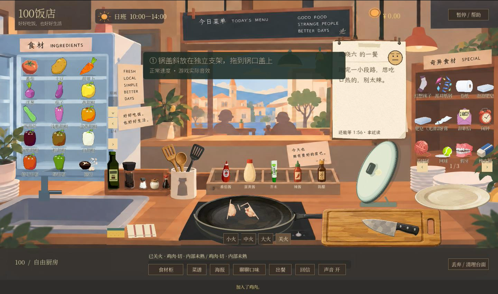
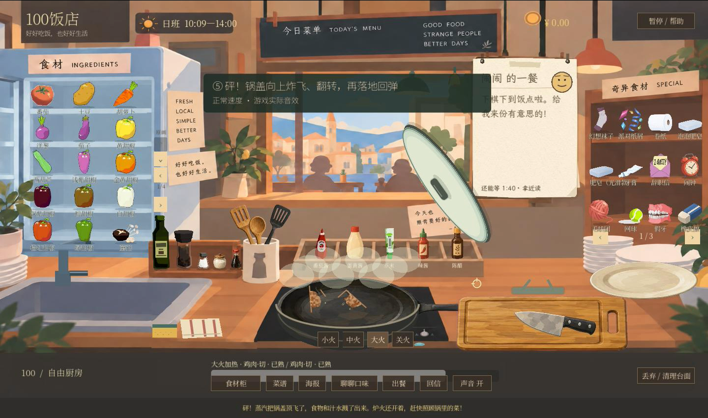
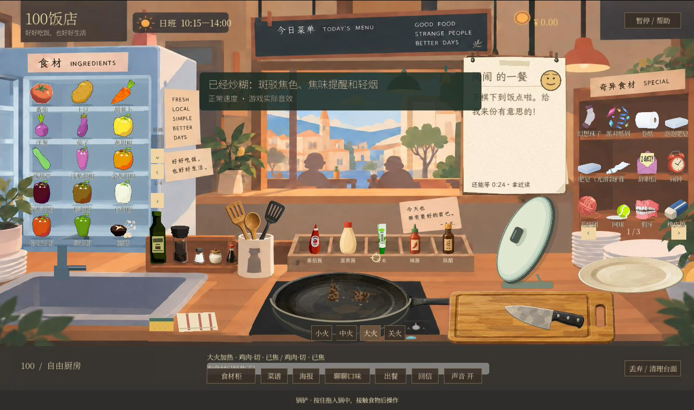

# 锅盖、向上炸飞与焦糊 · 2026-09-26 修订

本版修复用户截图中的锅盖与调料瓶重叠，并重做爆锅轨迹。旧版平放在调料架下面、低抛后横向归位的效果已被替换；当前默认锅盖斜放在独立支架，右侧调料瓶、盘子及菜板都可见、可取用。

## 操作和连续状态

按住锅盖把手拖到锅口，松手盖上；拖开泄汽，松手放回支架，Q 归位。斜放投影、选取范围和拾起均使用同一变换；盖上后切换到锅口共用的 `pan_geometry` / `pan_controller` 变换，移锅时连续跟随。原创代码绘制沿用当前二维色板，没有覆盖团队原画或引入外部美术。

`cooking_reactions` 是唯一固定物理步更新者。加盖降低散热，并提高食材暴露面的热环境；食材继续保留两面/核心温度、含水量、褐变、焦化和处理历史。蒸汽来自实际锅水与食材失水，分别记录留存、逸出和冷凝，有限冷凝水回锅。累计蒸发记录是相变通量，同一份冷凝水再次蒸发会再次记入，不能把它误当净损耗。

持续高温和湿食材/真实蒸汽提高游戏危险代理值。盖沿冒汽、冷凝点、颤动、短促抬起和锅具敲击逐渐出现，0.55 / 0.83 两级提醒先于爆锅。揭盖清空危险代理并释放留存蒸汽；移锅、减火及关火改变后续热状态，关火仍有余热。盖着摇锅不让食物穿盖，而会加快已经出现的危险积累。空干锅没有蒸汽，不因空锅受热或抖动爆锅。

达到上限后，锅盖以向上初速度 630 px/s、重力 720 px/s²逐步推进，明显上冲、旋转并改变投影，再下落到右侧空位。落地有短暂回弹与倾摆，逐渐稳定到斜放姿态；取消旧版落点瞬移。飞行中不能抓住盖子，落稳后可再用。喷汽团保留在实际锅口，不随盖子飞走或翻转。

同一批锅内刚体获得有限向上/侧向速度，汁水飞溅从锅水实际扣除（8%，至多 45 ml），进入现有溢出状态；不复制或替换食材。炉火保留实际开关状态。倾锅超过 85° 的旧滑盖归位行为继续存在，它不是爆锅轨迹。

盖上有实际碰撞上壁，阻止穿盖选取、加料、敲蛋、下调料和锅铲翻拌；水龙头遇盖进入水槽。锅柄与火力按钮仍可使用。暂停冻结热反应与空中飞行；取消拖盖/失焦释放手持锅盖。

菜持续干煎会在实际接触面逐渐褐变、焦化、失水，新增逐件焦糊提醒和由温度/焦化驱动的轻烟。锅铲向上翻动切换接触面，露出真实焦糊底面，不清除历史，也不凭空黑化另一面。大量水中不新增焦化，加水不修复已经烧焦的表面；摆盘、照片、食材快照、菜谱和顾客评价沿用原有 `char` 状态。

## 验证和生产画面

- `tests/test_pan_lid.gd`：无头与 Apple M4 OpenGL 各 **31 项通过**，包含引擎鼠标按下/移动/松开路由、斜放选取与空间留白、盖子碰撞及穿盖拦截、蒸汽冷凝守恒、暂停/泄汽/降温、实际加热爆锅、同一食物刚体、高于锅口 220 像素的上冲、旋转/重力下落、连续轨迹、回弹归稳复用、空中暂停、实际锅铲翻出焦面、湿热/快照、移锅/空锅/水龙头。
- 热锅鸡肉受控夹具通过真实固定步加热，79 秒后触发。这是时间压缩游戏参数的夹具结果，不是现实烹饪时间或所有食材的固定倒计时。
- `tools/test.ps1` 的 **43 个入口全部通过**，包含热/反应、空间、存档、录音、切配、摆盘、顾客及集成。[全量日志](../qa/20260926-pan-lid-v2/regression.txt)、[GPU 专项](../qa/20260926-pan-lid-v2/gpu-test.log)、[源码启动 120 帧](../qa/20260926-pan-lid-v2/startup.log)。本机无 PowerShell，按入口清单逐脚本运行，不能称为执行过 `pwsh`。
- 已查看真实 GPU 场景及最终 MP4 解码帧。以下为生产录制的关键帧；自动输入不冒充原生系统鼠标人工试玩（此前系统控制工具返回 `noWindowsAvailable`），也不替代长期乱操作或人耳音色验收。

## 新版新增功能录像

[观看约 90 秒视频](../../../demo/100Restaurant_Pan_Lid_Blast_Burning_V2_20260926_CN.mp4)。Godot 4.7.2 正式 GPU 场景的自动输入实录，保留实际游戏音轨，只录新增段，从已经切好并入锅的两块真实鸡肉开始；不是做饭全流程，也不是截图拼接。

脚本 `tests/capture_pan_lid.gd` 通过引擎鼠标事件拿盖、揭盖、摇锅、点击火力和锅铲向上翻面，**20 项流程断言通过**。等待段对整套模拟加速 5–6 倍且明确标注；爆锅、回弹、揭盖、翻面按正常速度展示，没有注入锅温、危险值或焦化数值。

时间：0–8 秒支架取盖和开火；8–23 秒积汽震动；23–27 秒揭盖泄汽；27–56 秒重新加盖、盖锅摇动与升温；约 56–61 秒向上炸飞、翻转、落地回弹；62–73 秒继续干煎；73–85 秒锅铲翻出焦面、轻烟；85–90 秒关火及余热。

最终文件 **89.583 秒、2150 帧、24 FPS、1440 × 852**，1 个 H.264 视频轨 / 1 个游戏声音轨。原始 851 像素高为编码补一行。PCM 为 48 kHz 双声道，89.583 秒，峰值 0.152008、RMS 0.009317、0 个削波采样；盖锅、敲盖、泄汽、爆锅、翻面及关火段非静音，音视频时长一致。这是技术审计，不是人耳拟真评级。

[录制日志](../qa/20260926-pan-lid-v2/capture.log)、[时间线](../qa/20260926-pan-lid-v2/capture-timeline.json)、[最终视频解码](../qa/20260926-pan-lid-v2/video-check.log)、[声音审计](../qa/20260926-pan-lid-v2/audio-check.json)。时间线为脚本事件计帧，开场引擎准备造成与最终 Movie Maker 帧数相差 4 帧；最终影片时长以上述实际轨道为准。

MP4 SHA-256：`fe17001783ca0b7ea0efe30066dbd77806c0024cd2f303060bf01cd346536091`。

复现：在本目录运行 `Godot --path . --write-movie <output.avi> --fixed-fps 24 --script tests/capture_pan_lid.gd --quit-after 18000 -- <evidence-prefix>`，再使用已有 `tools/extract_godot_avi.py`、`tools/encode_godot_movie.swift` 和 `tools/mux_godot_movie.swift` 提取、编码及合并声音。GPU 专项用 `Godot --path . --script tests/test_pan_lid.gd -- <evidence-prefix>`。

## 状态与边界

**已实现并验证**：上述交互、空间投影、连续飞行/回弹、实际焦面翻出、热状态、有限蒸汽和汁水账本、GPU 帧、录像与自动回归。

**近似实现**：二维器具与旋转投影、时间压缩热模型、局部烟汽与冷凝点、危险代理和定向落点。普通平底锅盖不是密闭压力容器，爆锅为用户要求的夸张游戏反馈，不是真实压力爆炸仿真；没有火灾或锅体碎裂。敲盖、顶盖及落地复用已有、许可核验的 CC0 `pan` / `hot_drop` 外部录音，没有合成拟音或未知许可素材。

**尚未实现**：三维流体/真实蒸汽压力场、独立盖子热容、任意环境碰撞的完整三维飞行、油滴自由流体、完整班次中途持久化。危险值属于当次场景。完整工作台恢复的既有缺口未在本轮扩展。
