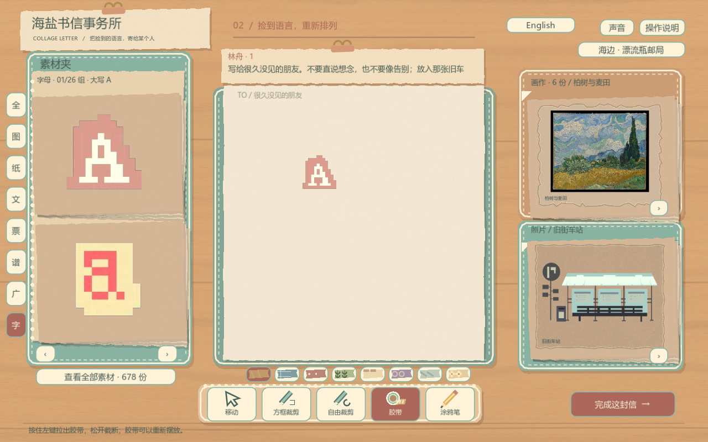

# Solmere · 拼贴书信工作台

Godot 4.5.1+ 独立项目，也集成于主游戏的书信事务所。当前以 2D 木桌、纸片堆叠和手绘信封呈现，保留刻刀裁切、自由拼贴和可部署的漂流瓶服务。

## 启动

安装 Godot 4.5.1+ 与 Python 3.10+，将 Godot 加入 PATH，或设置 `GODOT_BIN`。在此目录执行 `python server/launch.py`，或运行 `Start-Game.cmd`。便携试玩包另附运行时；GitHub 源码不包含引擎、玩家数据或缓存。

`Start-Two-Players.cmd` 使用两个独立身份连接同一本机邮局。`Start-LAN-Server.cmd` 开启局域网服务；公网部署见 [服务器说明](server/README.md)。尚未开通公共服务器。

## 工作台

- 678 份独立可用的材料：100 图案、96 纹理纸、160 广告、120 文字片语、121 票据、17 乐谱剪片、6 画作、6 小镇场景照片卡、52 大小写字母。
- 字母从用户的两张原图拆分；只去外侧白底，保留像素轮廓和不透明部分的 RGB。点击素材库字母即可直接放到信纸，也能从左侧字母夹拖出。
- 手写改为自由涂鸦，4 种墨色；8 种胶带纹样。后放置的物件位于上层，拉胶带时预览在所有纸片上方。
- 画作在右上，照片卡在右下；私人车票位于左侧票据夹。翻页使用箭头图标。
- 12 份轮换委托直接出现在工作台上方，不再先经过人物开场对话。
- 折信后拖入信封，翻盖向下拉；火柴划过火柴盒点燃，再点蜡烛。蜡粒放入勺内、加热、对准封口浇蜡、压章一秒、冷却。偏移或短按会留下不可撤回的瑕疵。
- 点击封好的信打开信箱，拖进投信口，向下拉箱盖完成投递。火漆与信封保持同一移动变换。

右上角切换中英文，或启动参数 `-- --lang=en`。中文印刷内容约 80.3% 中文；英文系统界面及本项目创作的材料文案为英文。用户输入、历史信件和已裁下的纸片保留原语言。

678 是材料条目数，包含本项目设计的文案与排版，**不是 678 张独立下载的原图**。真实扫描纸纹、已出版的乐谱排印图、CC0 手绘纸件与桌面纹理来源见 [素材说明](assets/open_pack/README.md)。

详见 [操作指南](GUIDE.md)、[来源与组件](OPEN_SOURCE_REVIEW.md)、[验证记录](docs/VALIDATION.md)。

## 单页手账界面

依据用户提供的《絮絮手账本》视频参考，工作台采用薄荷绿布面素材夹、纸质分类签、图片收纳框、文具图标和真实胶带纹理小样。中央始终是一张完整信纸，没有双页装订线。参考仅用于视觉层级和交互方式，没有提取商业游戏的美术或代码。原有 678 素材、裁剪、涂鸦、装信、封蜡、漂流瓶和存档继续使用。

左边 8 个分类签可直接切换；悬停查看完整分类及数量。下方的刻刀、胶带、铅笔有独立图示；选中胶带时直接预览 8 种图案。窗口缩放和英文按钮长度均经过实际 Godot 控件尺寸检查。
