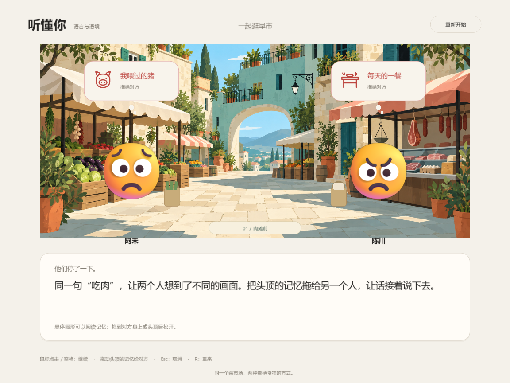

# 听懂你 · 菜市场里的语言与语境

两个 emoji 角色在菜市场买菜，因为「吃肉」发生争执。玩家旁听逐句对话，在停顿时交换双方想到的图形与记忆，让 NPC 当场回应、逐渐理解彼此。结尾保留各自的饮食选择。

这是独立 Godot 原型，尚未接入 Solmere 的主场景。仓库的 `prototypes/.gdignore` 将它与主项目的资源导入隔离。



## 运行

使用 Godot 4.7.2 或更新版本，导入本目录的 `project.godot`，按 F5。无需服务端或账户。

也可以在仓库根目录运行：

```sh
godot --editor --path prototypes/hear-you --import
godot --path prototypes/hear-you
```

Godot 可执行文件名可能是 `godot4`，请按本机安装情况替换。

中文和 emoji 使用系统字体。Windows 已在 Microsoft YaHei / Segoe UI Emoji 环境验证；其他系统需要可用的中文字体和彩色 emoji 字体（代码含 PingFang / Noto 等回退项），尚未实机验证。

## 操作

- 点击下方对话框或按空格/回车：显示整句，再次操作进入下一句。
- 对话停顿时，悬停头顶的图形可读记忆；按住并拖到另一位人物身上或头顶后松开，对方会接话。
- 每段的两枚记忆可按任意顺序分享。错投回位，不扣分。
- Esc 取消拖动；R 或右上角按钮重来。
- 键盘替代：停顿时按 1 分享左侧记忆、按 2 分享右侧记忆。

共有三段对话、六次记忆交换，红色表达争执，黑色回应表示新的理解。

## 文件结构

- `npc_dialogue.gd`：当前主逻辑，含菜市场背景、emoji 人物、对白、拖动与结尾。
- `main.gd`：首版基础脚本，新版继承其中的字体、绘图和合成音效；运行时不会显示旧版界面。
- `main.tscn`：指向 `npc_dialogue.gd` 的主场景。
- `assets/market-painted.png`：实际使用的 AI 生成市场插画。
- `assets/*.svg`：原创记忆图形。
- `ART_NOTES.md`：场景的生成方式、参考角色与提示词。原始参考图片未纳入仓库。

## 验证

在有图形显示的环境中运行（该检查包含实际渲染，不要加 `--headless`）：

```sh
godot --path prototypes/hear-you -- --qa
```

检查两种分享顺序、对白阶段、NPC 回应、错误目标、重复提交、三段推进、结尾和重来。成功输出 `QA PASS` 并退出。设置 `HEARYOU_QA_DIR` 为已存在的目录，可额外保存阶段截图。

已在 Windows / Godot 4.7.2 / OpenGL Compatibility 下验证。仓库不包含 Godot 引擎、导入缓存或独立发行包。
